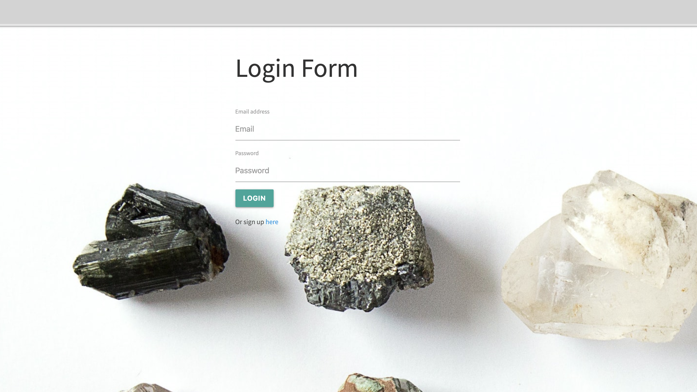
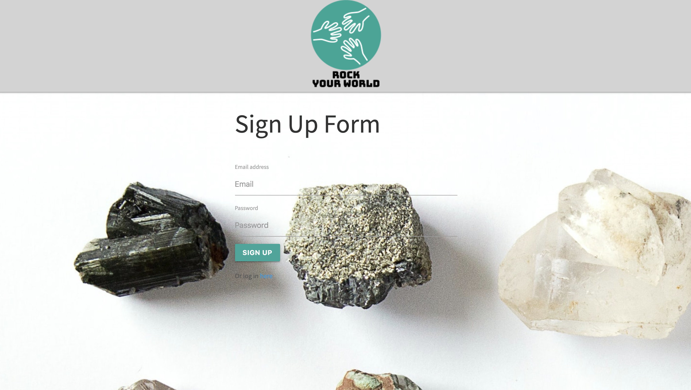
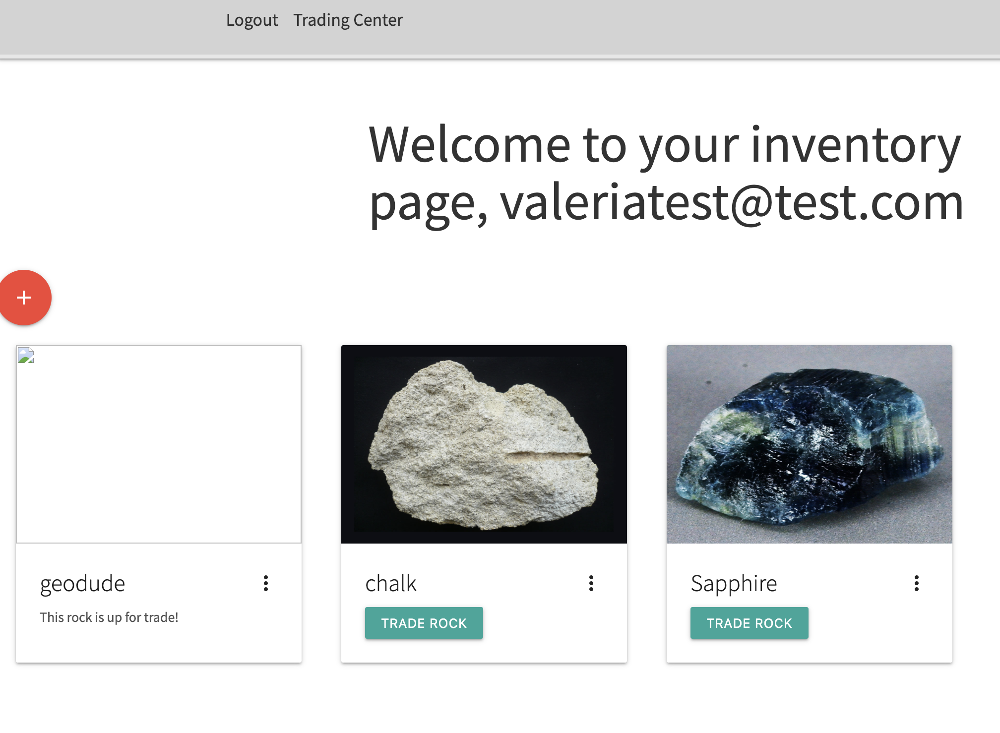
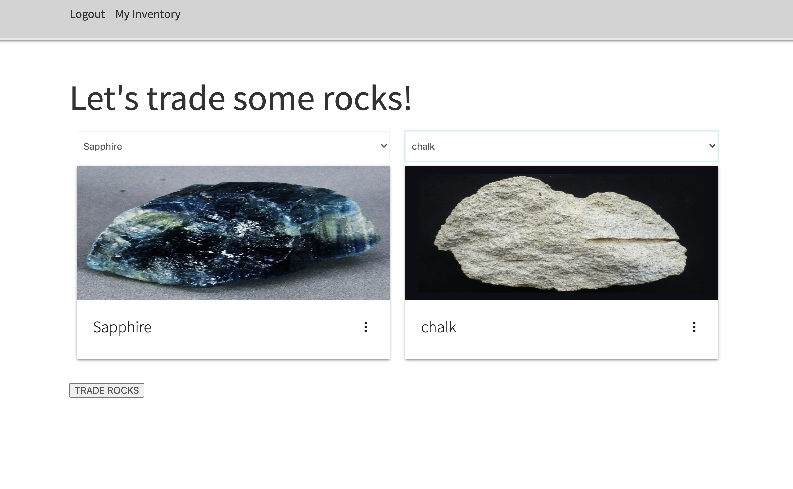

# Project-2

### USER STORY

AS A USER I want to be able to barter and trade rocks with other collectors

SO THAT I can diversify my own rock collection

GIVEN I want to trade a rock for a new one

WHEN I have a rock to trade

THEN I can add a new rock to my inventory

WHEN I am ready to make a trade

THEN I can add one of my rocks to a marketplace for other rock collectors to see

WHEN I go to the Trading Center

THEN I can click on one of my rocks and the rock I want to trade for
WHEN the trade is complete

THEN the new rock is added to my inventory and the old rock is removed

### DEPLOYED APPLICATION

https://rock-trader-2020.herokuapp.com/

### TEAM

Aldo Patino - Backend Engineer

Himaja Sriramaneni - Frontend Engineer/Backend Engineer

Christian Miller - Backend Engineer

Valeria Gonzalez Leyva - Frontend Engineer

